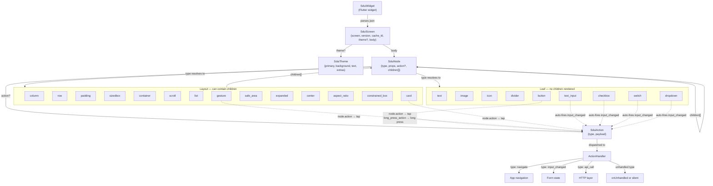

# Flutter SDUI Client SDK — Schema Documentation

> Generated from source: `flutter_sdui_kit@0.3.2`, `flutter_sdui_converter@1.0.2`, `flutter_sdui_annotations@1.0.1`, `flutter_sdui_test@1.0.1`

---

## Directory Structure Explored

```
packages/
├── flutter_sdui_annotations/
│   └── lib/src/flutter_sdui_annotations_base.dart   ← @SduiComponent, @SduiProp, @SduiAction
│
├── flutter_sdui_converter/
│   └── lib/src/
│       ├── config/config_loader.dart + sdui_config.dart
│       ├── converter.dart                            ← converterVersion = '1.0.1' (hardcoded)
│       ├── differ/schema_differ.dart
│       ├── emitter/json_emitter.dart
│       ├── models/sdui_schema.dart + sdui_component.dart + sdui_prop.dart
│       ├── parser/component_parser.dart
│       ├── scanner/file_scanner.dart
│       └── transformer/schema_transformer.dart       ← Dart→SDUI type map, _generatedBy constant
│
├── flutter_sdui_kit/
│   └── lib/src/
│       ├── models/sdui_screen.dart + sdui_node.dart + sdui_action.dart + sdui_theme.dart
│       ├── core/sdui_renderer.dart + action_handler.dart + expression_evaluator.dart
│       ├── styles/style_parser.dart
│       ├── components/
│       │   ├── text_builder.dart
│       │   ├── button_builder.dart
│       │   ├── image_builder.dart
│       │   ├── gesture_builder.dart
│       │   ├── layout_builders.dart      ← column, row
│       │   ├── container_builders.dart   ← padding, sizedbox, container
│       │   └── common_builders.dart      ← scroll, list, card, divider, icon, safe_area,
│       │                                    expanded, center, aspect_ratio, constrained_box
│       │       form_builders.dart        ← text_input, checkbox, switch, dropdown
│       └── sdui_widget.dart
│
└── flutter_sdui_test/
    └── lib/src/
        ├── golden_test.dart + device_presets.dart + schema_loader.dart + diff_reporter.dart

No .json fixtures found in any test/ directory.
```

---

# Part 1 — Widget Schema Reference

> **Important distinction**: This part documents the **screen payload** — the JSON a server sends to `SduiWidget` at runtime — not the converter's output schema. The screen payload envelope is defined by `SduiScreen`. Each widget described here is one `SduiNode` within the `body` tree.

### Node Envelope (applies to every widget)

Every node in the tree has this shape:

```json
{
  "type": "string",
  "props": {},
  "action": { "type": "string", "payload": {} },
  "children": []
}
```

| Field | Type | Required | Nullable | Default | Notes |
|-------|------|----------|----------|---------|-------|
| `type` | string | **Yes** | No | — | Must match a registered component type. Missing `type` throws a cast error at parse time. |
| `props` | object | No | No | `{}` | Absent `props` key → treated as empty map. `null` value → treated as empty map. |
| `action` | object | No | Yes | `null` | Absent `action` key → `null`. Present key with `null` value is NOT handled (throws). |
| `children` | array | No | No | `[]` | Absent `children` key → empty list. |

#### Universal cross-cutting props (valid on any node)

| Prop | Type | Notes |
|------|------|-------|
| `visible_if` | string | Expression evaluated against `data`. False → `SizedBox.shrink()`. Error → `SizedBox.shrink()` + `onError` callback. Empty string → renders (treated as true). |
| `flex` | integer | Only meaningful when the direct parent is `column` or `row`. Wraps this node in `Expanded(flex: N)`. Has no effect on other parent types. |
| `flex_fit` | `"tight"` \| `"loose"` | Only meaningful alongside `flex`. `"loose"` → `Flexible` instead of `Expanded`. Default: `"tight"`. |

---

## `text`

Renders a Flutter `Text` widget.

```
---
title: text
category: Widgets
platforms: [flutter]
schema_version: "1.0.0"
status: stable
---
```

**One-line description**: Displays a string of text with optional style preset, color override, line clamping, and alignment.

### JSON shape

```json
{
  "type": "text",
  "props": {
    "content": "Hello world",        // string — the text to display
    "style": "body",                 // string enum — typographic preset
    "color": "#1A1A2E",              // string — hex color override
    "max_lines": 2,                  // integer — clamp to N lines
    "text_align": "center"           // string enum — horizontal alignment
  }
}
```

### Field reference

| Field | Type | Required | Nullable | Default | Notes |
|-------|------|----------|----------|---------|-------|
| `content` | string | No | No | `""` | Missing or null → empty string rendered. Supports `{{path}}` template syntax. |
| `style` | string | No | No | `"body"` (14sp, normal) | Unknown value falls through to 14sp normal weight. |
| `color` | string | No | Yes | `null` | When absent/null, the `style` preset's color (black) is used. Hex format: `#RGB`, `#RRGGBB`, or `#AARRGGBB`. |
| `max_lines` | integer | No | Yes | `null` | Absent/null → unlimited lines. When set, overflow is `TextOverflow.ellipsis`. |
| `text_align` | string | No | Yes | `null` | Absent/null → Flutter default (`TextAlign.start`). Unknown value → `null` (same as absent). |

### `style` enum

| Value | Font size | Font weight | Default? |
|-------|-----------|-------------|----------|
| `"heading"` | 24sp | bold (700) | |
| `"subheading"` | 18sp | semibold (600) | |
| `"body"` | 14sp | normal (400) | ✓ (fallback for unknown values) |
| `"caption"` | 12sp | normal (400) | |

### `text_align` enum

| Value | Flutter equivalent | Default? |
|-------|--------------------|----------|
| `"left"` | `TextAlign.left` | |
| `"center"` | `TextAlign.center` | |
| `"right"` | `TextAlign.right` | |
| _(absent or unknown)_ | `null` (Flutter default: start) | ✓ |

### Minimal valid JSON

```json
{ "type": "text", "props": { "content": "Hello" } }
```

### Full JSON example

```json
{
  "type": "text",
  "props": {
    "content": "Welcome, {{user.name}}!",
    "style": "heading",
    "color": "#6C63FF",
    "max_lines": 1,
    "text_align": "center"
  }
}
```

### Invalid JSON examples

```json
{ "type": "text", "props": { "content": 42 } }
```

**Reason**: `content` is cast to `String?`. Passing a non-string value causes a cast error in the builder, which triggers the error boundary (`SizedBox.shrink`).

```json
{ "type": "text", "props": { "max_lines": "two" } }
```

**Reason**: `max_lines` is cast to `int?`. A string value throws a cast error.

### Flutter rendering notes

- Uses Flutter's `Text` widget directly — no Material dependency.
- `content` is resolved through `TemplateResolver` before rendering. Unresolved `{{path}}` expressions remain as literal text.
- `color` is parsed by `StyleParser.colorFromHex`. Malformed hex strings fall back to `Color(0xFF000000)` (black).

---

## `button`

Renders a tappable button with three style variants.

```
---
title: button
category: Widgets
platforms: [flutter]
schema_version: "1.0.0"
status: stable
---
```

**One-line description**: Tappable button supporting primary (filled), outline (bordered), and text (no background) variants; fires an action on tap.

### JSON shape

```json
{
  "type": "button",
  "props": {
    "label": "Submit",          // string — button text
    "variant": "primary",       // string enum
    "full_width": false,        // boolean
    "background": "#6C63FF",    // string — hex, primary variant only
    "text_color": "#FFFFFF",    // string — hex, primary variant only
    "corner_radius": 8          // number
  },
  "action": {
    "type": "navigate",
    "payload": { "route": "/home" }
  }
}
```

### Field reference

| Field | Type | Required | Nullable | Default | Notes |
|-------|------|----------|----------|---------|-------|
| `label` | string | No | No | `""` | Button text. |
| `variant` | string | No | No | `"primary"` | Unknown value falls back to `"primary"`. |
| `full_width` | boolean | No | No | `false` | When `true`, button stretches to parent width. |
| `background` | string | No | Yes | theme `primary` color | Only applied in `"primary"` variant. Ignored for `"outline"` and `"text"`. |
| `text_color` | string | No | Yes | `#FFFFFF` | Only applied in `"primary"` variant. Ignored for others (always uses theme primary). |
| `corner_radius` | number | No | No | `8` | Border radius in logical pixels. |
| _(node)_ `action` | object | No | Yes | `null` | Absent/null → button renders but tap does nothing (`onTap: null`). |

### `variant` enum

| Value | Background | Text color | Border | Default? |
|-------|-----------|-----------|--------|----------|
| `"primary"` | theme primary (overridable) | `#FFFFFF` (overridable) | none | ✓ |
| `"outline"` | transparent | theme primary | 1px theme primary | |
| `"text"` | transparent | theme primary | none | |

### Minimal valid JSON

```json
{ "type": "button", "props": { "label": "OK" } }
```

### Full JSON example

```json
{
  "type": "button",
  "props": {
    "label": "Create Account",
    "variant": "primary",
    "full_width": true,
    "background": "#4CAF50",
    "text_color": "#FFFFFF",
    "corner_radius": 12
  },
  "action": {
    "type": "api_call",
    "payload": { "endpoint": "/register" }
  }
}
```

### Invalid JSON examples

```json
{ "type": "button", "props": { "corner_radius": "8px" } }
```

**Reason**: `corner_radius` is cast to `num?` and then `.toDouble()`. A string value throws a cast error.

```json
{ "type": "button", "props": { "full_width": 1 } }
```

**Reason**: `full_width` is cast to `bool?`. An integer `1` throws a cast error (Dart's type system does not coerce integers to booleans).

### Flutter rendering notes

- No Material dependency. Uses `Container` + `GestureDetector` + `Builder`.
- The `Builder` is required so the tap handler receives a `BuildContext` that is below any `Navigator` ancestor.
- `background` and `text_color` are only read when `variant == "primary"` — sending them alongside `"outline"` or `"text"` is ignored silently.
- `full_width: false` uses `Align(widthFactor: 1.0)` — button shrinks to its content width.

---

## `image`

Renders a network image with optional aspect ratio enforcement and rounded corners.

```
---
title: image
category: Widgets
platforms: [flutter]
schema_version: "1.0.0"
status: stable
---
```

**One-line description**: Loads and displays a network image with clipping, aspect ratio control, and `BoxFit` scaling.

### JSON shape

```json
{
  "type": "image",
  "props": {
    "url": "https://example.com/photo.jpg",   // string — image URL
    "aspect_ratio": 1.78,                      // number — width÷height (e.g. 16/9)
    "corner_radius": 8,                        // number
    "width": 320,                              // number
    "height": 180,                             // number
    "fit": "cover"                             // string enum
  }
}
```

### Field reference

| Field | Type | Required | Nullable | Default | Notes |
|-------|------|----------|----------|---------|-------|
| `url` | string | No | No | `""` | Missing/null → empty string URL. Network request will fail; error builder produces `SizedBox.shrink`. |
| `aspect_ratio` | number | No | Yes | `null` | When present, wraps image in `AspectRatio`. Applied after corner clipping. |
| `corner_radius` | number | No | No | `0` | When `> 0`, wraps image in `ClipRRect`. |
| `width` | number | No | Yes | `null` | Applied directly to `Image.network`. |
| `height` | number | No | Yes | `null` | Applied directly to `Image.network`. |
| `fit` | string | No | No | `"cover"` | Unknown values also fall back to `"cover"`. |

### `fit` enum

| Value | Flutter equivalent | Default? |
|-------|--------------------|----------|
| `"cover"` | `BoxFit.cover` | ✓ |
| `"contain"` | `BoxFit.contain` | |
| `"fill"` | `BoxFit.fill` | |
| `"fitWidth"` | `BoxFit.fitWidth` | |
| `"fitHeight"` | `BoxFit.fitHeight` | |
| `"none"` | `BoxFit.none` | |

### Minimal valid JSON

```json
{ "type": "image", "props": { "url": "https://example.com/img.jpg" } }
```

### Full JSON example

```json
{
  "type": "image",
  "props": {
    "url": "https://cdn.example.com/hero.jpg",
    "aspect_ratio": 1.78,
    "corner_radius": 12,
    "fit": "cover"
  }
}
```

### Invalid JSON examples

```json
{ "type": "image", "props": { "aspect_ratio": "16:9" } }
```

**Reason**: `aspect_ratio` is cast to `num?`. A string value throws a cast error.

```json
{ "type": "image", "props": { "corner_radius": true } }
```

**Reason**: `corner_radius` is cast to `num?`. A boolean throws a cast error.

### Flutter rendering notes

- Uses `Image.network`. No asset loading support.
- `errorBuilder` silently swallows load failures with `SizedBox.shrink` — no error is propagated to `onError`.
- Build order: `Image.network` → `ClipRRect` (if `corner_radius > 0`) → `AspectRatio` (if `aspect_ratio != null`). The aspect ratio is enforced around the already-clipped image.
- `width`/`height` without `aspect_ratio` → Image respects the given dimensions. With `aspect_ratio` → `AspectRatio` overrides the height constraint.

---

## `icon`

Renders a named icon using a Unicode/text placeholder.

```
---
title: icon
category: Widgets
platforms: [flutter]
schema_version: "1.0.0"
status: experimental
---
```

**One-line description**: Placeholder icon renderer that maps a small set of named icons to Unicode emoji/symbols; all other names render as `•`.

### JSON shape

```json
{
  "type": "icon",
  "props": {
    "name": "star",      // string — icon name
    "size": 24,          // number
    "color": "#1A1A2E"   // string — hex color
  }
}
```

### Field reference

| Field | Type | Required | Nullable | Default | Notes |
|-------|------|----------|----------|---------|-------|
| `name` | string | No | No | `"star"` | See known names table below. All unknown values → `•`. |
| `size` | number | No | No | `24` | Both width and height of the bounding `SizedBox`. Text font size = `size * 0.8`. |
| `color` | string | No | Yes | `Color(0xFF000000)` (black) | Hex color applied to the text style. |

### Known icon names

| `name` value | Rendered character |
|--------------|--------------------|
| `"star"` | ⭐ |
| `"favorite"` | ❤️ |
| `"home"` | 🏠 |
| `"search"` | 🔍 |
| `"settings"` | ⚙️ |
| `"local_offer"` | 🏷️ |
| _(any other)_ | `•` |

### Minimal valid JSON

```json
{ "type": "icon", "props": { "name": "star" } }
```

### Full JSON example

```json
{
  "type": "icon",
  "props": {
    "name": "favorite",
    "size": 32,
    "color": "#E91E63"
  }
}
```

### Invalid JSON examples

```json
{ "type": "icon", "props": { "size": "large" } }
```

**Reason**: `size` is cast to `num?`. A string value throws a cast error.

```json
{ "type": "icon", "props": { "color": 16711680 } }
```

**Reason**: `color` is cast to `String?`. An integer throws a cast error.

### Flutter rendering notes

- **This is a placeholder implementation.** The comment in source explicitly states: "Placeholder: render the icon name as text. When you add Material dependency later, replace this with `Icon(iconDataMap[name])`."
- Emoji rendering is font-dependent; golden tests on different platforms may produce different glyphs.
- The `color` prop applies to the text/emoji style, but most emoji are rendered by the OS and ignore text color.

---

## `column`

Renders a vertical flex container.

```
---
title: column
category: Widgets
platforms: [flutter]
schema_version: "1.0.0"
status: stable
---
```

**One-line description**: Vertical flex container that stacks children top-to-bottom with configurable spacing and alignment; optionally scrollable.

### JSON shape

```json
{
  "type": "column",
  "props": {
    "spacing": 16,                   // number — gap between children
    "cross_alignment": "stretch",    // string enum — cross-axis alignment
    "main_alignment": "start",       // string enum — main-axis alignment
    "scroll": false                  // boolean — wrap in SingleChildScrollView
  },
  "children": []
}
```

### Field reference

| Field | Type | Required | Nullable | Default | Notes |
|-------|------|----------|----------|---------|-------|
| `spacing` | number | No | No | `0` | Logical pixels. Inserts `SizedBox(height: spacing)` between each child. |
| `cross_alignment` | string | No | No | `"start"` | Unknown values fall back to `"start"`. |
| `main_alignment` | string | No | No | `"start"` | Unknown values fall back to `"start"`. |
| `scroll` | boolean | No | No | `false` | When `true`, wraps the `Column` in `SingleChildScrollView`. Useful to prevent overflow in fixed-height parents. |

### `cross_alignment` enum

| Value | Flutter equivalent | Default? |
|-------|--------------------|----------|
| `"start"` | `CrossAxisAlignment.start` | ✓ |
| `"center"` | `CrossAxisAlignment.center` | |
| `"end"` | `CrossAxisAlignment.end` | |
| `"stretch"` | `CrossAxisAlignment.stretch` | |

### `main_alignment` enum

| Value | Flutter equivalent | Default? |
|-------|--------------------|----------|
| `"start"` | `MainAxisAlignment.start` | ✓ |
| `"center"` | `MainAxisAlignment.center` | |
| `"end"` | `MainAxisAlignment.end` | |
| `"spaceBetween"` | `MainAxisAlignment.spaceBetween` | |
| `"spaceAround"` | `MainAxisAlignment.spaceAround` | |
| `"spaceEvenly"` | `MainAxisAlignment.spaceEvenly` | |

### Minimal valid JSON

```json
{
  "type": "column",
  "children": [
    { "type": "text", "props": { "content": "A" } },
    { "type": "text", "props": { "content": "B" } }
  ]
}
```

### Full JSON example

```json
{
  "type": "column",
  "props": {
    "spacing": 12,
    "cross_alignment": "stretch",
    "main_alignment": "start",
    "scroll": true
  },
  "children": [
    { "type": "text", "props": { "content": "Item 1" } },
    { "type": "text", "props": { "content": "Item 2", "flex": 1 } }
  ]
}
```

### Invalid JSON examples

```json
{ "type": "column", "props": { "spacing": "16px" } }
```

**Reason**: `spacing` is cast to `num?`. A string value throws a cast error.

```json
{ "type": "column", "props": { "scroll": "true" } }
```

**Reason**: `scroll` uses `== true` comparison, so a string `"true"` does not match boolean `true` and silently evaluates as `false`. While not a crash, it is a semantic bug.

### Flutter rendering notes

- `Column` always uses `MainAxisSize.min` — it claims only the height its children need, preventing unbounded height errors in nested scrollables.
- Children with `"flex": N` in their `props` are automatically wrapped in `Expanded(flex: N)`. Children with `"flex_fit": "loose"` use `Flexible` instead.
- Children whose `type` is `"expanded"` skip the auto-wrapping (the `expanded` builder handles it directly).
- When `scroll: true`, the `SingleChildScrollView` scroll direction is **vertical**.

---

## `row`

Renders a horizontal flex container.

```
---
title: row
category: Widgets
platforms: [flutter]
schema_version: "1.0.0"
status: stable
---
```

**One-line description**: Horizontal flex container that arranges children left-to-right with configurable spacing, alignment, and optional horizontal scrolling.

### JSON shape

```json
{
  "type": "row",
  "props": {
    "spacing": 8,
    "cross_alignment": "center",
    "main_alignment": "spaceBetween",
    "alignment": "center",
    "scroll": false
  },
  "children": []
}
```

### Field reference

| Field | Type | Required | Nullable | Default | Notes |
|-------|------|----------|----------|---------|-------|
| `spacing` | number | No | No | `0` | Inserts `SizedBox(width: spacing)` between children. |
| `cross_alignment` | string | No | No | `"start"` | Same enum as `column`. |
| `main_alignment` | string | No | No | `"start"` | Same enum as `column`. |
| `alignment` | string | No | No | `null` | **Alias** for `cross_alignment` on `row` only. If both are present, `cross_alignment` wins. |
| `scroll` | boolean | No | No | `false` | Wraps in `SingleChildScrollView(scrollDirection: Axis.horizontal)`. |

The `alignment` prop is a shorthand alias specific to `row`. It is equivalent to `cross_alignment` and exists for ergonomic reasons. The `column` builder does not recognize `alignment`.

### Minimal valid JSON

```json
{
  "type": "row",
  "children": [
    { "type": "text", "props": { "content": "Left" } },
    { "type": "text", "props": { "content": "Right" } }
  ]
}
```

### Full JSON example

```json
{
  "type": "row",
  "props": {
    "spacing": 8,
    "cross_alignment": "center",
    "main_alignment": "spaceBetween"
  },
  "children": [
    { "type": "icon", "props": { "name": "home" } },
    { "type": "text", "props": { "content": "Home", "flex": 1 } }
  ]
}
```

### Invalid JSON examples

```json
{ "type": "row", "props": { "spacing": -8 } }
```

**Reason**: Not a crash, but negative spacing produces negative-height `SizedBox` spacers, which Flutter clamps to zero. Effectively the same as `spacing: 0`. This will silently produce unexpected layout.

```json
{ "type": "row", "props": { "scroll": "yes" } }
```

**Reason**: Same as `column` — `"yes"` does not equal `true`, scroll silently disabled.

### Flutter rendering notes

- `Row` uses `MainAxisSize.min` — does not force full parent width.
- When `scroll: true`, use `SduiWidget`'s `ConstraintGuard` context to prevent unbounded-width errors in nested scroll views.

---

## `padding`

Applies inset padding around its children.

```
---
title: padding
category: Widgets
platforms: [flutter]
schema_version: "1.0.0"
status: stable
---
```

**One-line description**: Applies configurable insets around child content using Flutter's `Padding` widget.

### JSON shape

```json
{
  "type": "padding",
  "props": {
    "all": 16,
    "horizontal": 16,
    "vertical": 8,
    "left": 16,
    "right": 16,
    "top": 8,
    "bottom": 8
  },
  "children": []
}
```

### Field reference

Inset resolution priority: `all` wins if present. Otherwise, `horizontal`/`vertical` set defaults for each axis; `left`/`right`/`top`/`bottom` override individual edges.

| Field | Type | Required | Nullable | Default | Notes |
|-------|------|----------|----------|---------|-------|
| `all` | number | No | No | — | Uniform insets on all sides. When present, all other keys are ignored. |
| `horizontal` | number | No | No | `0` | Sets `left` and `right` defaults. |
| `vertical` | number | No | No | `0` | Sets `top` and `bottom` defaults. |
| `left` | number | No | No | `horizontal` value or `0` | |
| `right` | number | No | No | `horizontal` value or `0` | |
| `top` | number | No | No | `vertical` value or `0` | |
| `bottom` | number | No | No | `vertical` value or `0` | |

When all props are absent, padding is `EdgeInsets.zero`.

### Minimal valid JSON

```json
{
  "type": "padding",
  "props": { "all": 16 },
  "children": [{ "type": "text", "props": { "content": "Hello" } }]
}
```

### Full JSON example

```json
{
  "type": "padding",
  "props": { "horizontal": 24, "vertical": 12, "bottom": 24 },
  "children": [
    { "type": "text", "props": { "content": "Padded content" } }
  ]
}
```

### Invalid JSON examples

```json
{ "type": "padding", "props": { "all": "16" } }
```

**Reason**: `all` is accessed as `num` via `(props['all'] as num).toDouble()`. A string throws a cast error.

```json
{ "type": "padding", "props": { "top": null } }
```

**Reason**: `top` is cast to `num?`. A JSON `null` is valid (returns `null`, falls back to `vertical` or `0`), so this is actually **safe** — but only because the key resolves to the `num?` fallback path. **This is one of the few cases where a null value in `props` is handled gracefully.**

### Flutter rendering notes

- If `padding` has multiple children, they are wrapped in a `Column(mainAxisSize: MainAxisSize.min)` before being passed to `Padding`. The `Column` inherits `CrossAxisAlignment.start`.
- `padding` reads props **directly from `node.props`** using `StyleParser.edgeInsetsFromProps`. This is different from the `container` widget, where the `padding` prop is a **nested object**.

---

## `sizedbox`

Applies fixed or flexible dimensions to its content.

```
---
title: sizedbox
category: Widgets
platforms: [flutter]
schema_version: "1.0.0"
status: stable
---
```

**One-line description**: Constrains its content to explicit `width` and/or `height` values, or acts as a blank spacer when no children are provided.

### JSON shape

```json
{
  "type": "sizedbox",
  "props": {
    "width": 200,
    "height": 100
  },
  "children": []
}
```

### Field reference

| Field | Type | Required | Nullable | Default | Notes |
|-------|------|----------|----------|---------|-------|
| `width` | number | No | Yes | `null` | Absent/null → unconstrained on width axis. |
| `height` | number | No | Yes | `null` | Absent/null → unconstrained on height axis. |

**Children**: Only the **first** child is rendered. Additional children are silently ignored.

### Minimal valid JSON

```json
{ "type": "sizedbox", "props": { "height": 16 } }
```

(blank vertical spacer)

### Full JSON example

```json
{
  "type": "sizedbox",
  "props": { "width": 40, "height": 40 },
  "children": [{ "type": "icon", "props": { "name": "star", "size": 24 } }]
}
```

### Invalid JSON examples

```json
{ "type": "sizedbox", "props": { "width": "200" } }
```

**Reason**: `width` is cast to `num?`. A string throws a cast error.

```json
{
  "type": "sizedbox",
  "props": { "height": 80 },
  "children": [
    { "type": "text", "props": { "content": "A" } },
    { "type": "text", "props": { "content": "B" } }
  ]
}
```

**Reason**: Not a crash, but only `"A"` is rendered. This is a silent data loss scenario.

### Flutter rendering notes

- A `sizedbox` with no `children` and no `width`/`height` is equivalent to `SizedBox.shrink()`. Useful as a deliberate empty placeholder.

---

## `container`

A styled box with background color, border radius, explicit dimensions, and optional padding.

```
---
title: container
category: Widgets
platforms: [flutter]
schema_version: "1.0.0"
status: stable
---
```

**One-line description**: Generic styled container with background color, rounded corners, explicit dimensions, and inner padding.

### JSON shape

```json
{
  "type": "container",
  "props": {
    "background": "#F5F5F5",
    "corner_radius": 12,
    "width": 300,
    "height": 200,
    "padding": {
      "all": 16
    }
  },
  "children": []
}
```

### Field reference

| Field | Type | Required | Nullable | Default | Notes |
|-------|------|----------|----------|---------|-------|
| `background` | string | No | Yes | `null` (transparent) | Hex color. Absent or null → no background. |
| `corner_radius` | number | No | No | `0` | Border radius in logical pixels. |
| `width` | number | No | Yes | `null` | |
| `height` | number | No | Yes | `null` | |
| `padding` | object | No | Yes | `null` | Nested object with the same inset keys as the `padding` widget (`all`, `horizontal`, `vertical`, `left`, `right`, `top`, `bottom`). Absent → no padding. |

> ⚠️ **`elevation` is NOT implemented**: The builder's doc comment lists `elevation` as supported, but the `containerBuilder` source code does not read or apply it. Sending an `elevation` prop to `container` has no visual effect. See Open Questions §7.1.

### Minimal valid JSON

```json
{
  "type": "container",
  "props": { "background": "#EEEEEE" },
  "children": [{ "type": "text", "props": { "content": "Inside" } }]
}
```

### Full JSON example

```json
{
  "type": "container",
  "props": {
    "background": "#FFFFFF",
    "corner_radius": 8,
    "width": 320,
    "padding": { "horizontal": 16, "vertical": 12 }
  },
  "children": [
    { "type": "text", "props": { "content": "Card content" } }
  ]
}
```

### Invalid JSON examples

```json
{ "type": "container", "props": { "padding": 16 } }
```

**Reason**: `padding` is cast to `Map<String, dynamic>`. An integer throws a cast error.

```json
{ "type": "container", "props": { "corner_radius": "8" } }
```

**Reason**: `corner_radius` is cast to `num?`. A string throws a cast error.

### Flutter rendering notes

- Multiple children are wrapped in `Column(mainAxisSize: MainAxisSize.min, crossAxisAlignment: CrossAxisAlignment.start)`.
- `corner_radius > 0` only affects the `BoxDecoration.borderRadius` — it does **not** clip children. Use `card` (which uses `ClipRRect`) if you need child clipping.
- `padding` prop value must be a JSON **object**, not a scalar. This is different from the `padding` widget, which reads inset keys directly from `node.props`.

---

## `scroll`

A scrollable container that wraps children in a `SingleChildScrollView`.

```
---
title: scroll
category: Widgets
platforms: [flutter]
schema_version: "1.0.0"
status: stable
---
```

**One-line description**: Makes its children scrollable in a single direction.

### JSON shape

```json
{
  "type": "scroll",
  "props": {
    "direction": "vertical"
  },
  "children": []
}
```

### Field reference

| Field | Type | Required | Nullable | Default | Notes |
|-------|------|----------|----------|---------|-------|
| `direction` | string | No | No | `"vertical"` | Any value that is not `"horizontal"` → vertical. |

### `direction` enum

| Value | Flutter equivalent | Default? |
|-------|--------------------|----------|
| `"vertical"` | `Axis.vertical` | ✓ |
| `"horizontal"` | `Axis.horizontal` | |

### Minimal valid JSON

```json
{
  "type": "scroll",
  "children": [
    { "type": "text", "props": { "content": "Long content..." } }
  ]
}
```

### Full JSON example

```json
{
  "type": "scroll",
  "props": { "direction": "horizontal" },
  "children": [
    { "type": "image", "props": { "url": "https://example.com/img1.jpg", "width": 200 } },
    { "type": "image", "props": { "url": "https://example.com/img2.jpg", "width": 200 } }
  ]
}
```

### Invalid JSON examples

```json
{ "type": "scroll", "props": { "direction": "both" } }
```

**Reason**: Not a crash, but `"both"` is not `"horizontal"`, so it silently defaults to vertical. Dual-axis scrolling is not supported.

```json
{ "type": "scroll", "props": { "direction": null } }
```

**Reason**: `null` is not `== "horizontal"`, so silently defaults to vertical. Safe but potentially surprising.

### Flutter rendering notes

- Vertical `scroll` wraps children in `Column(mainAxisSize: MainAxisSize.min, crossAxisAlignment: CrossAxisAlignment.stretch)`.
- Horizontal `scroll` wraps children in `Row(mainAxisSize: MainAxisSize.min)`.
- Unlike `list`, `scroll` uses default `ScrollPhysics` — it is a true primary scrollable.

---

## `list`

A performant scrollable list using `ListView.builder`.

```
---
title: list
category: Widgets
platforms: [flutter]
schema_version: "1.0.0"
status: stable
---
```

**One-line description**: Renders children as a scrollable list via `ListView.builder` with spacing and padding support.

### JSON shape

```json
{
  "type": "list",
  "props": {
    "direction": "vertical",
    "spacing": 8,
    "padding": { "all": 16 },
    "item_extent": 72,
    "width": null,
    "height": 400
  },
  "children": []
}
```

### Field reference

| Field | Type | Required | Nullable | Default | Notes |
|-------|------|----------|----------|---------|-------|
| `direction` | string | No | No | `"vertical"` | |
| `spacing` | number | No | No | `0` | Gap between items. Implemented as alternating real-child / SizedBox-spacer entries in the builder. |
| `padding` | object | No | Yes | `EdgeInsets.zero` | Same nested-object format as `container.padding`. |
| `item_extent` | number | No | Yes | `null` | Enables `ListView.builder`'s fixed-extent optimisation. All children must be the stated size. |
| `width` | number | No | Yes | `null` | Wraps the list in a `SizedBox` when set. |
| `height` | number | No | Yes | `null` | Wraps the list in a `SizedBox` when set. **Strongly recommended** for horizontal lists inside a `column`. |

### Minimal valid JSON

```json
{
  "type": "list",
  "children": [
    { "type": "text", "props": { "content": "Item 1" } },
    { "type": "text", "props": { "content": "Item 2" } }
  ]
}
```

### Full JSON example

```json
{
  "type": "list",
  "props": {
    "direction": "vertical",
    "spacing": 12,
    "padding": { "horizontal": 16, "vertical": 8 },
    "height": 400
  },
  "children": [
    { "type": "card", "props": { "corner_radius": 8 } }
  ]
}
```

### Invalid JSON examples

```json
{ "type": "list", "props": { "padding": 16 } }
```

**Reason**: `padding` is cast to `Map<String, dynamic>`. An integer throws a cast error.

```json
{ "type": "list", "props": { "item_extent": "72px" } }
```

**Reason**: `item_extent` is cast to `num?`. A string throws a cast error.

### Flutter rendering notes

- `list` **always** uses `NeverScrollableScrollPhysics`. If you place a `list` as the outermost widget, it will NOT scroll — wrap it in a `scroll` node or provide an outer `SingleChildScrollView`.
- This is intentional: `list` is designed for use inside a parent scrollable that controls the scroll physics.
- Spacing is implemented by doubling the `itemCount` (real items + spacers), not by using `separatorBuilder`. This means `item_extent` applies to spacers equally — only set `item_extent` when spacing is `0`.

---

## `card`

An elevated card container with optional tap action.

```
---
title: card
category: Widgets
platforms: [flutter]
schema_version: "1.0.0"
status: stable
---
```

**One-line description**: Styled container with background, rounded corners, drop shadow, and optional tap-to-action behavior.

### JSON shape

```json
{
  "type": "card",
  "props": {
    "corner_radius": 8,
    "background": "#FFFFFF",
    "elevation": 4,
    "width": 320
  },
  "action": {
    "type": "navigate",
    "payload": { "route": "/detail" }
  },
  "children": []
}
```

### Field reference

| Field | Type | Required | Nullable | Default | Notes |
|-------|------|----------|----------|---------|-------|
| `corner_radius` | number | No | No | `0` | Applies `ClipRRect` to clip children — unlike `container` which does not clip. |
| `background` | string | No | No | `#FFFFFF` | Default is white, not transparent. |
| `elevation` | number | No | No | `0` | When `> 0`, adds a `BoxShadow` with `blurRadius = elevation * 2` and `offset = (0, elevation)`. |
| `width` | number | No | Yes | `null` | |
| _(node)_ `action` | object | No | Yes | `null` | When present, wraps the card in a `GestureDetector`. |

> ⚠️ **`padding` is NOT implemented**: The builder's doc comment mentions `padding` as a supported prop, but the `cardBuilder` source code does not read or apply it. See Open Questions §7.2.

### Minimal valid JSON

```json
{
  "type": "card",
  "children": [{ "type": "text", "props": { "content": "Card title" } }]
}
```

### Full JSON example

```json
{
  "type": "card",
  "props": {
    "corner_radius": 12,
    "background": "#FAFAFA",
    "elevation": 6,
    "width": 320
  },
  "action": {
    "type": "navigate",
    "payload": { "route": "/product/123" }
  },
  "children": [
    { "type": "image", "props": { "url": "https://example.com/product.jpg", "aspect_ratio": 1.5 } },
    { "type": "text", "props": { "content": "Product Name", "style": "subheading" } }
  ]
}
```

### Invalid JSON examples

```json
{ "type": "card", "props": { "elevation": "4" } }
```

**Reason**: `elevation` is cast to `num?`. A string throws a cast error.

```json
{ "type": "card", "props": { "background": 16777215 } }
```

**Reason**: `background` is checked with `containsKey` then cast to `String?`. An integer throws a cast error.

### Flutter rendering notes

- `card` uses `ClipRRect` when `corner_radius > 0`, so children are clipped. This differs from `container`, which applies `borderRadius` to the decoration only.
- The `Builder` widget wraps the `GestureDetector` so the tap handler receives a valid post-Navigator `BuildContext`.
- The shadow uses a fixed `Color(0x29000000)` — approximately 16% black. This is not theme-aware.
- Multiple children are wrapped in `Column(mainAxisSize: MainAxisSize.min, crossAxisAlignment: CrossAxisAlignment.start)`.

---

## `divider`

A thin horizontal line for visual separation.

```
---
title: divider
category: Widgets
platforms: [flutter]
schema_version: "1.0.0"
status: stable
---
```

**One-line description**: Renders a full-width horizontal rule with configurable color and thickness.

### JSON shape

```json
{
  "type": "divider",
  "props": {
    "color": "#E0E0E0",
    "thickness": 1
  }
}
```

### Field reference

| Field | Type | Required | Nullable | Default | Notes |
|-------|------|----------|----------|---------|-------|
| `color` | string | No | No | `#E0E0E0` | Hex color. |
| `thickness` | number | No | No | `1` | Height in logical pixels. |

### Minimal valid JSON

```json
{ "type": "divider" }
```

### Full JSON example

```json
{
  "type": "divider",
  "props": { "color": "#BDBDBD", "thickness": 2 }
}
```

### Invalid JSON examples

```json
{ "type": "divider", "props": { "thickness": "thin" } }
```

**Reason**: `thickness` is cast to `num?`. A string throws a cast error.

### Flutter rendering notes

- Implemented as `Container(height: thickness, color: color)` — full available width, no Material dependency.
- Vertical dividers are not supported.

---

## `safe_area`

Wraps content to respect system safe areas.

```
---
title: safe_area
category: Widgets
platforms: [flutter]
schema_version: "1.0.0"
status: stable
---
```

**One-line description**: Insets children to avoid system UI intrusions (status bar, navigation bar, notch).

### JSON shape

```json
{
  "type": "safe_area",
  "props": {
    "top": true,
    "bottom": true,
    "left": true,
    "right": true
  },
  "children": []
}
```

### Field reference

| Field | Type | Required | Nullable | Default | Notes |
|-------|------|----------|----------|---------|-------|
| `top` | boolean | No | No | `true` | |
| `bottom` | boolean | No | No | `true` | |
| `left` | boolean | No | No | `true` | |
| `right` | boolean | No | No | `true` | |

### Minimal valid JSON

```json
{
  "type": "safe_area",
  "children": [{ "type": "text", "props": { "content": "Content" } }]
}
```

### Full JSON example

```json
{
  "type": "safe_area",
  "props": { "top": true, "bottom": false },
  "children": [{ "type": "column", "children": [] }]
}
```

### Invalid JSON examples

```json
{ "type": "safe_area", "props": { "top": "yes" } }
```

**Reason**: `top` is cast to `bool?`. A string throws a cast error.

### Flutter rendering notes

- Multiple children are wrapped in `Column(mainAxisSize: MainAxisSize.min, crossAxisAlignment: CrossAxisAlignment.start)`.
- Setting all four to `false` is equivalent to no safe area at all.

---

## `expanded`

Wraps a child in `Expanded` or `Flexible` for flex layout sizing.

```
---
title: expanded
category: Widgets
platforms: [flutter]
schema_version: "1.0.0"
status: stable
---
```

**One-line description**: Explicit flex-fill wrapper — fills remaining space in a `column` or `row` parent.

### JSON shape

```json
{
  "type": "expanded",
  "props": {
    "flex": 1,
    "fit": "tight"
  },
  "children": []
}
```

### Field reference

| Field | Type | Required | Nullable | Default | Notes |
|-------|------|----------|----------|---------|-------|
| `flex` | integer | No | No | `1` | Flex factor. |
| `fit` | string | No | No | `"tight"` | `"tight"` → `Expanded`. `"loose"` → `Flexible`. |

### `fit` enum

| Value | Flutter equivalent | Default? |
|-------|--------------------|----------|
| `"tight"` | `Expanded` | ✓ |
| `"loose"` | `Flexible` | |

### Minimal valid JSON

```json
{
  "type": "expanded",
  "children": [{ "type": "text", "props": { "content": "Fills space" } }]
}
```

### Flutter rendering notes

- Equivalent to using the inline `"flex": 1` prop on any child node inside a `column`/`row`. `expanded` is the explicit JSON form; `flex` prop is the shorthand.
- Children of `expanded` type are skipped by the inline flex-wrapping logic in `_buildFlexChildren` to prevent double-wrapping.
- **Only meaningful inside `column` or `row`**. Using `expanded` outside a flex parent causes a Flutter assertion error.

---

## `center`

Centers its child within the available space.

```
---
title: center
category: Widgets
platforms: [flutter]
schema_version: "1.0.0"
status: stable
---
```

**One-line description**: Centers child content within the parent's available space.

### JSON shape

```json
{
  "type": "center",
  "children": []
}
```

No props are recognized.

### Minimal valid JSON

```json
{
  "type": "center",
  "children": [{ "type": "text", "props": { "content": "Centered" } }]
}
```

### Flutter rendering notes

- Multiple children are wrapped in `Column(mainAxisSize: MainAxisSize.min)`.
- `Center` expands to fill available space and centers its child.

---

## `aspect_ratio`

Enforces a specific width-to-height ratio on its child.

```
---
title: aspect_ratio
category: Widgets
platforms: [flutter]
schema_version: "1.0.0"
status: stable
---
```

**One-line description**: Constrains child to a specific aspect ratio, sizing height from the available width.

### JSON shape

```json
{
  "type": "aspect_ratio",
  "props": {
    "ratio": 1.78
  },
  "children": []
}
```

### Field reference

| Field | Type | Required | Nullable | Default | Notes |
|-------|------|----------|----------|---------|-------|
| `ratio` | number | No | No | `1.0` | Width ÷ height. `1.78` ≈ 16:9. `1.0` = square. |

### Minimal valid JSON

```json
{
  "type": "aspect_ratio",
  "props": { "ratio": 1.78 },
  "children": [{ "type": "image", "props": { "url": "https://example.com/img.jpg" } }]
}
```

### Flutter rendering notes

- Only the **first** child is used. Additional children are silently ignored.
- When `children` is empty, renders `SizedBox.shrink()` inside the aspect ratio box.

---

## `constrained_box`

Applies explicit min/max size constraints.

```
---
title: constrained_box
category: Widgets
platforms: [flutter]
schema_version: "1.0.0"
status: stable
---
```

**One-line description**: Wraps a child in explicit min/max width and height constraints.

### JSON shape

```json
{
  "type": "constrained_box",
  "props": {
    "min_width": 0,
    "max_width": 400,
    "min_height": 0,
    "max_height": 300
  },
  "children": []
}
```

### Field reference

| Field | Type | Required | Nullable | Default | Notes |
|-------|------|----------|----------|---------|-------|
| `min_width` | number | No | No | `0` | |
| `max_width` | number | No | No | `double.infinity` | Omit to leave unconstrained. |
| `min_height` | number | No | No | `0` | |
| `max_height` | number | No | No | `double.infinity` | Omit to leave unconstrained. |

### Minimal valid JSON

```json
{
  "type": "constrained_box",
  "props": { "max_width": 500 },
  "children": [{ "type": "text", "props": { "content": "Constrained" } }]
}
```

### Flutter rendering notes

- Only the first child is used. If `children` is empty, renders `SizedBox.shrink()`.
- Constraints must satisfy `min <= max`. Passing `min_width > max_width` causes a Flutter assertion error in debug mode and undefined layout in release mode.

---

## `text_input`

A stateful text field.

```
---
title: text_input
category: Widgets
platforms: [flutter]
schema_version: "1.0.0"
status: stable
---
```

**One-line description**: Editable text field that fires `input_changed` actions on every keystroke and an optional `action` on submit.

### JSON shape

```json
{
  "type": "text_input",
  "props": {
    "placeholder": "Enter email",
    "value": "",
    "field": "email",
    "max_lines": 1,
    "keyboard_type": "email",
    "obscure": false,
    "border_color": "#CCCCCC",
    "corner_radius": 8
  },
  "action": {
    "type": "submit_form",
    "payload": {}
  }
}
```

### Field reference

| Field | Type | Required | Nullable | Default | Notes |
|-------|------|----------|----------|---------|-------|
| `placeholder` | string | No | No | `""` | Hint text — currently NOT rendered (see Open Questions §7.4). |
| `value` | string | No | No | `""` | **Initial** value only. Not a controlled value. |
| `field` | string | No | No | `""` | Key sent in the `input_changed` action payload. |
| `max_lines` | integer | No | No | `1` | `1` = single-line. `> 1` = multiline. |
| `keyboard_type` | string | No | No | — | Declared but **NOT implemented** (see Open Questions §7.3). |
| `obscure` | boolean | No | No | `false` | Password masking. |
| `border_color` | string | No | No | `#CCCCCC` | Hex color. |
| `corner_radius` | number | No | No | `8` | |
| _(node)_ `action` | object | No | Yes | `null` | Fired on text submission (keyboard "done" key). |

### Auto-fired action

On every text change:

```json
{
  "type": "input_changed",
  "payload": {
    "field": "<value of props.field>",
    "value": "<current text>"
  }
}
```

### Minimal valid JSON

```json
{ "type": "text_input", "props": { "placeholder": "Your name", "field": "name" } }
```

### Full JSON example

```json
{
  "type": "text_input",
  "props": {
    "placeholder": "Password",
    "field": "password",
    "obscure": true,
    "border_color": "#6C63FF",
    "corner_radius": 12
  },
  "action": { "type": "login", "payload": {} }
}
```

### Invalid JSON examples

```json
{ "type": "text_input", "props": { "max_lines": "many" } }
```

**Reason**: `max_lines` is cast to `int?`. A string throws a cast error.

```json
{ "type": "text_input", "props": { "obscure": 1 } }
```

**Reason**: `obscure` is cast to `bool?`. An integer throws a cast error.

### Flutter rendering notes

- Uses `EditableText` (not `TextField`) — no Material dependency. No label, no floating hint, no underline.
- `placeholder` is read from props but `EditableText` has no hint text support — it is a no-op currently.
- Each rebuild creates a new `FocusNode` in the `build` method — may cause focus loss on parent rebuilds.
- `keyboard_type` has no effect — not wired to `EditableText.keyboardType`.
- `value` is used only during `initState`. Widget does not respond to prop changes after initial mount.

---

## `checkbox`

A stateful checkbox toggle with label.

```
---
title: checkbox
category: Widgets
platforms: [flutter]
schema_version: "1.0.0"
status: stable
---
```

**One-line description**: Toggleable checkbox with optional label that fires `input_changed` on state change.

### JSON shape

```json
{
  "type": "checkbox",
  "props": {
    "checked": false,
    "label": "I agree to terms",
    "field": "agreed",
    "size": 20,
    "active_color": "#6C63FF"
  }
}
```

### Field reference

| Field | Type | Required | Nullable | Default | Notes |
|-------|------|----------|----------|---------|-------|
| `checked` | boolean | No | No | `false` | Initial checked state. Not a controlled value. |
| `label` | string | No | No | `""` | When non-empty, renders inline text label to the right. |
| `field` | string | No | No | `""` | Key in the `input_changed` payload. |
| `size` | number | No | No | `20` | Width and height of the checkbox square in logical pixels. |
| `active_color` | string | No | No | `#6C63FF` | Checked fill and border color. |

### Auto-fired action

```json
{
  "type": "input_changed",
  "payload": { "field": "<field>", "value": true }
}
```

`value` is a **boolean** (not a string).

### Minimal valid JSON

```json
{ "type": "checkbox", "props": { "field": "agreed" } }
```

### Flutter rendering notes

- Custom implementation — not Flutter's `Checkbox` widget. No Material dependency.
- The checkmark is rendered as the Unicode `✓` character sized at `size * 0.7`.
- No half-checked (indeterminate) state.

---

## `switch`

A stateful toggle switch.

```
---
title: switch
category: Widgets
platforms: [flutter]
schema_version: "1.0.0"
status: stable
---
```

**One-line description**: Animated toggle switch that fires `input_changed` on state change.

### JSON shape

```json
{
  "type": "switch",
  "props": {
    "value": false,
    "label": "Enable notifications",
    "field": "notifications_enabled",
    "active_color": "#6C63FF"
  }
}
```

### Field reference

| Field | Type | Required | Nullable | Default | Notes |
|-------|------|----------|----------|---------|-------|
| `value` | boolean | No | No | `false` | Initial on/off state. Not controlled. |
| `label` | string | No | No | `""` | Inline text label rendered to the right. |
| `field` | string | No | No | `""` | Key in `input_changed` payload. |
| `active_color` | string | No | No | `#6C63FF` | Track fill color when on. |

### Auto-fired action

```json
{
  "type": "input_changed",
  "payload": { "field": "<field>", "value": true }
}
```

### Minimal valid JSON

```json
{ "type": "switch", "props": { "field": "dark_mode" } }
```

### Flutter rendering notes

- Custom animated implementation using `AnimatedContainer` + `AnimatedAlign`.
- Track is 48×28 logical pixels, knob is 22×22. Dimensions are hardcoded — no `size` prop.
- Off-state track color: `#CCCCCC` (hardcoded, not theme-aware).

---

## `dropdown`

A stateful dropdown selector.

```
---
title: dropdown
category: Widgets
platforms: [flutter]
schema_version: "1.0.0"
status: stable
---
```

**One-line description**: Tap-to-expand dropdown that presents a list of options inline and fires `input_changed` on selection.

### JSON shape

```json
{
  "type": "dropdown",
  "props": {
    "options": [
      { "label": "Option A", "value": "a" },
      { "label": "Option B", "value": "b" }
    ],
    "selected": null,
    "placeholder": "Select an option",
    "field": "choice",
    "corner_radius": 8,
    "border_color": "#CCCCCC"
  }
}
```

### Field reference

| Field | Type | Required | Nullable | Default | Notes |
|-------|------|----------|----------|---------|-------|
| `options` | array of objects | No | No | `[]` | Each entry: `{ "label": string, "value": any }`. |
| `selected` | string | No | Yes | `null` | Initially selected option value. `null` → placeholder shown. |
| `placeholder` | string | No | No | `"Select..."` | Text shown when no option is selected. |
| `field` | string | No | No | `""` | Key in `input_changed` payload. |
| `corner_radius` | number | No | No | `8` | |
| `border_color` | string | No | No | `#CCCCCC` | |

### Option object shape

```json
{ "label": "Display text", "value": "submitted_value" }
```

`value` is coerced to string via `.toString()`. `label` defaults to `value.toString()` if absent.

### Auto-fired action

```json
{
  "type": "input_changed",
  "payload": { "field": "<field>", "value": "b" }
}
```

`value` in the payload is a **string**.

### Minimal valid JSON

```json
{
  "type": "dropdown",
  "props": {
    "field": "country",
    "options": [
      { "label": "United States", "value": "us" },
      { "label": "Canada", "value": "ca" }
    ]
  }
}
```

### Invalid JSON examples

```json
{ "type": "dropdown", "props": { "options": "US,CA" } }
```

**Reason**: `options` is cast to `List<dynamic>?`. A string throws a cast error.

```json
{ "type": "dropdown", "props": { "options": [{ "value": "a" }] } }
```

**Reason**: Not a crash — the option renders using `value.toString()` as the label. Always provide `label` explicitly.

### Flutter rendering notes

- **Inline expander, not an overlay.** The option list opens below the trigger in the same layout flow. It can push content down and may be clipped inside a fixed-height container.
- Selected option highlight color: `0x1A6C63FF` (10% primary purple, hardcoded — not theme-aware).
- `selected` is used only during `initState`. Widget does not respond to changes in `selected` after initial mount.

---

## `gesture`

Wraps a subtree in a `GestureDetector`.

```
---
title: gesture
category: Widgets
platforms: [flutter]
schema_version: "1.0.0"
status: stable
---
```

**One-line description**: Makes a child subtree tappable (and optionally long-pressable) by wrapping it in a `GestureDetector`.

### JSON shape

```json
{
  "type": "gesture",
  "props": {
    "behavior": "opaque",
    "long_press_action": {
      "type": "show_context_menu",
      "payload": {}
    }
  },
  "action": {
    "type": "navigate",
    "payload": { "route": "/detail" }
  },
  "children": []
}
```

### Field reference

| Field | Type | Required | Nullable | Default | Notes |
|-------|------|----------|----------|---------|-------|
| `behavior` | string | No | No | `"opaque"` | Hit-test behavior. Unknown value → `"opaque"`. |
| `long_press_action` | object | No | Yes | `null` | Full action object `{ "type": "...", "payload": {} }`. Wires `GestureDetector.onLongPress`. |
| _(node)_ `action` | object | No | Yes | `null` | Wires `GestureDetector.onTap`. |

### `behavior` enum

| Value | Flutter equivalent | Default? |
|-------|--------------------|----------|
| `"opaque"` | `HitTestBehavior.opaque` | ✓ |
| `"translucent"` | `HitTestBehavior.translucent` | |
| `"defer"` | `HitTestBehavior.deferToChild` | |

### Minimal valid JSON

```json
{
  "type": "gesture",
  "action": { "type": "navigate", "payload": { "route": "/" } },
  "children": [{ "type": "text", "props": { "content": "Tap me" } }]
}
```

### Full JSON example

```json
{
  "type": "gesture",
  "props": {
    "behavior": "opaque",
    "long_press_action": {
      "type": "delete_item",
      "payload": { "id": "123" }
    }
  },
  "action": { "type": "select_item", "payload": { "id": "123" } },
  "children": [
    { "type": "card", "props": { "corner_radius": 8 } }
  ]
}
```

### Invalid JSON examples

```json
{ "type": "gesture", "props": { "long_press_action": "navigate" } }
```

**Reason**: `long_press_action` is passed to `SduiAction.fromJson`, which expects a `Map<String, dynamic>`. A string throws a cast error.

```json
{
  "type": "gesture",
  "props": { "behavior": "opaque" },
  "children": []
}
```

**Reason**: Not a crash, but a `gesture` with no `action` and no `long_press_action` is a no-op GestureDetector.

### Flutter rendering notes

- Uses `Builder` to pass a valid post-render `BuildContext` to the action handler.
- Multiple children are wrapped in `Column` (without `MainAxisSize.min` — this is a deviation from other builders, see Open Questions §7.13).
- `gesture` is redundant when wrapping a `button` or `card` that already has an `action`. Use it for non-interactive content that needs to become tappable.

---

# Part 2 — Schema Metadata Reference

> **Note**: The schema envelope is the output of `flutter_sdui_converter`. It is a separate JSON document from the **screen payload** (which `SduiWidget` consumes at runtime). Do not confuse `SduiSchema.schemaVersion` with `SduiScreen.version`.

## The Schema Envelope

```json
{
  "schemaVersion": "1.0.0",
  "generatedAt": "2026-04-11T10:30:00.000Z",
  "generatedBy": "flutter_sdui_converter",
  "converterVersion": "1.0.1",
  "components": [
    {
      "type": "PrimaryButton",
      "props": [
        { "name": "label", "type": "string", "required": true },
        { "name": "color", "type": "string", "required": false, "default": "blue" }
      ],
      "supportsAction": true
    }
  ]
}
```

---

### `schemaVersion`

| Attribute | Value |
|-----------|-------|
| Type | string |
| Format | Semver (`MAJOR.MINOR.PATCH[-prerelease][+build]`) |
| Source | `version` field in `flutter_sdui.yaml`; defaults to `"1.0.0"` when file is absent |
| Validated | Yes — `ConfigLoader` throws `FormatException` on non-semver values |
| Example | `"2.1.0"` |

**Semantics**: Developer-controlled schema version. Bump this when the set of components, their props, or action contracts change.

**Forward compatibility**: If a client receives a schema with a higher `schemaVersion` than it has been tested against, it should log a warning but continue parsing. No enforcement is currently implemented.

---

### `generatedAt`

| Attribute | Value |
|-----------|-------|
| Type | string |
| Format | ISO 8601 UTC (`DateTime.now().toUtc().toIso8601String()`) |
| Source | Stamped at conversion time |
| Example | `"2026-04-11T10:30:00.000000Z"` |

**Semantics**: Timestamp of when the schema was generated. Useful for cache invalidation and audit trails.

**Forward compatibility**: Clients that do not use this field should ignore it.

---

### `generatedBy`

| Attribute | Value |
|-----------|-------|
| Type | string |
| Format | Constant string |
| Source | Hardcoded in `schema_transformer.dart` |
| Current value | `"flutter_sdui_converter"` |

**Forward compatibility**: Clients should not fail if this field contains an unexpected value. Treat as informational.

---

### `converterVersion`

| Attribute | Value |
|-----------|-------|
| Type | string |
| Format | Semver |
| Source | Hardcoded constant `_converterVersion` in `converter.dart` |
| Current value | `"1.0.1"` |

**Forward compatibility**: If this field is missing, clients should treat it as `"0.0.0"` and apply maximum compatibility handling.

> ⚠️ **Known discrepancy**: `_converterVersion` is hardcoded as `"1.0.1"` while `pubspec.yaml` is `"1.0.2"`. See Open Questions §7.5.

---

### `components` array

Each entry:

```json
{
  "type": "string",
  "props": [
    { "name": "string", "type": "string", "required": true, "default": "any" }
  ],
  "supportsAction": false
}
```

#### Component fields

| Field | Type | Notes |
|-------|------|-------|
| `type` | string | Matches `name` in `@SduiComponent(name: '...')`. |
| `props` | array | May be empty. |
| `supportsAction` | boolean | `true` if at least one `@SduiAction` or callback-typed field. |

#### Prop fields

| Field | Type | Notes |
|-------|------|-------|
| `name` | string | Dart constructor field name. |
| `type` | string | SDUI type token. |
| `required` | boolean | `true` when `!isNullable && !hasDefaultValue`. |
| `default` | any | Omitted when no default exists. |

#### SDUI type token mapping

| Dart type | SDUI type token |
|-----------|----------------|
| `String` | `"string"` |
| `int` | `"integer"` |
| `double` | `"number"` |
| `num` | `"number"` |
| `bool` | `"boolean"` |
| `Color` | `"color"` |
| `List<T>` | `"array"` |
| `Map<K,V>` | `"object"` |
| `VoidCallback` / `Function` | classified as action (not a prop) |
| Unknown | `"any"` (or error in strict mode) |

---

### `SduiScreen.version` vs `SduiSchema.schemaVersion`

| Field | Location | Type | Meaning |
|-------|----------|------|---------|
| `SduiSchema.schemaVersion` | Converter output | string (semver) | Version of the developer's component set |
| `SduiScreen.version` | Runtime screen payload | integer | Version of this specific screen response |

Do not conflate them. The screen `version` is for screen-level cache/migration; `schemaVersion` tracks the component catalogue.

---

# Part 3 — Breaking vs Non-Breaking Change Reference

Derived from `SchemaDiffer.diff()` in `schema_differ.dart`.

| Change Type | Breaking? | Client Impact |
|-------------|-----------|---------------|
| Component removed | ✅ Yes | `unknownComponent` error; renders `SizedBox.shrink` |
| Required prop removed | ✅ Yes | Server stops sending field; client falls back to default — may silently corrupt layout |
| Optional prop removed | ✅ Yes | SchemaDiffer treats **all** prop removals as breaking regardless of `required` flag |
| Prop type changed | ✅ Yes | Cast error in builder → error boundary renders `SizedBox.shrink` |
| Prop became required | ✅ Yes | Old server responses that omit the prop now fail validation |
| Required prop added | ✅ Yes | Existing server responses don't include it; client falls back to coded default |
| Action support removed | ✅ Yes | Servers that relied on the action slot no longer have a client handler target |
| Component added | ❌ No | Unknown type handled gracefully by error boundary |
| Optional prop added | ❌ No | Client ignores new props safely |
| Default value added to existing prop | ❌ No | Only changes fallback; existing consumers unaffected |
| Action support added | ❌ No | New capability; old consumers unaffected |
| `required → non-required` | ❌ No | Explicitly non-breaking per SchemaDiffer source |

### Changes SchemaDiffer does NOT currently detect

- Enum value removed from a prop (schema stores `"type": "string"`, not valid values)
- Prop renamed (detected as prop removed + prop added)
- Component renamed (detected as component removed + component added)
- `default` value changed (only addition of a new default is tracked)

---

# Part 4 — Client Parsing Contract

---

### Rule 1 — Unknown fields MUST be ignored

**Status: ✅ Implemented**

`SduiNode.props` is `Map<String, dynamic>`. Each builder reads only its own keys. Extra keys in `props` or extra top-level keys in the screen payload are silently ignored.

---

### Rule 2 — Missing optional fields: fall back to code defaults

**Status: ✅ Implemented**

| Field | Missing → |
|-------|-----------|
| `SduiScreen.version` | `1` |
| `SduiScreen.cache_ttl` | `0` |
| `SduiScreen.theme` | `null` |
| `SduiNode.props` | `{}` |
| `SduiNode.children` | `[]` |
| `SduiNode.action` | `null` |
| `SduiAction.payload` | `{}` |
| `SduiTheme.primary` | `#6C63FF` |
| `SduiTheme.background` | `#FFFFFF` |
| `SduiTheme.text` | `#000000` |

---

### Rule 3 — Null vs missing: distinct semantics

**Status: ⚠️ Partially implemented**

The SDK uses `containsKey` checks for `action` and `theme` to distinguish "key absent" from "key present with null value". If `"action": null` is sent (key present, value null), the cast to `Map<String, dynamic>` will throw.

**Rule**: Never send `"action": null` or `"theme": null` — omit the key entirely to signal absence.

⚠️ **NOT IMPLEMENTED**: The SDK does not distinguish null from missing for individual prop values within builders. Both absent-key and null-value fall through to the `as T?` default.

---

### Rule 4 — Type coercion

**Status: ✅ Numbers only**

All numeric props use `(props['x'] as num?)?.toDouble()`. Both `int` and `double` JSON values are accepted for any numeric prop.

No other coercion is performed:

| Type expectation | Integer input | Boolean input | String input |
|-----------------|---------------|---------------|--------------|
| `string` | ❌ Cast error | ❌ Cast error | ✅ |
| `integer` / `number` | ✅ | ❌ Cast error | ❌ Cast error |
| `boolean` | ❌ Cast error | ✅ | ❌ Cast error |

⚠️ **NOT IMPLEMENTED**: String-to-number coercion (e.g., `"spacing": "16"`) is not supported.

---

### Rule 5 — Enum unknown value handling

**Status: ✅ Implemented — silent default fallback**

All enum-mapped string props use a `switch` with a `_ =>` default. Unknown values silently fall back to the documented default. All clients must not throw on unknown enum values.

---

### Rule 6 — Schema version mismatch behavior

**Status: ⚠️ NOT IMPLEMENTED**

`SduiWidget` does not inspect `SduiScreen.version`. There is no version-gating, migration path, or warning.

⚠️ **NOT IMPLEMENTED**: Client-side version checking — must be defined before multi-platform expansion.

---

### Rule 7 — Error handling contract

| Error scenario | Flutter SDK behavior |
|---------------|---------------------|
| `json` is `null` or empty | Return `fallback` widget |
| JSON parse failure | `onError(SduiError(type: parse))`, return `fallback` |
| Unknown `type` in node | `onError(SduiError(type: unknownComponent))`, render error widget or `SizedBox.shrink` |
| Builder throws | `onError(SduiError(type: render))`, render error widget or `SizedBox.shrink` |
| `visible_if` evaluation fails | `onError(SduiError(type: expression))`, render `SizedBox.shrink` |
| `body` key missing from screen payload | **Unhandled exception** — bypasses error boundary |
| `type` key missing from node | **Unhandled exception** — bypasses error boundary |

---

# Part 5 — Widget Relationship Map



### Widget nesting rules

| Widget | Renders children? | Max children | Notes |
|--------|------------------|-------------|-------|
| `column` | Yes | unlimited | |
| `row` | Yes | unlimited | |
| `padding` | Yes | unlimited | Multiple → inner Column |
| `sizedbox` | Yes | **1** | Additional children ignored |
| `container` | Yes | unlimited | Multiple → inner Column |
| `scroll` | Yes | unlimited | |
| `list` | Yes | unlimited | Uses ListView.builder |
| `card` | Yes | unlimited | Multiple → inner Column |
| `safe_area` | Yes | unlimited | Multiple → inner Column |
| `expanded` | Yes | unlimited | Multiple → inner Column |
| `center` | Yes | unlimited | Multiple → inner Column |
| `aspect_ratio` | Yes | **1** | Additional children ignored |
| `constrained_box` | Yes | **1** | Additional children ignored |
| `gesture` | Yes | unlimited | Multiple → Column (no MainAxisSize.min) |
| `text` | No | — | |
| `image` | No | — | |
| `icon` | No | — | |
| `divider` | No | — | |
| `button` | No | — | |
| `text_input` | No | — | |
| `checkbox` | No | — | |
| `switch` | No | — | |
| `dropdown` | No | — | |

---

# Part 6 — Platform Expansion Notes

> Android Native and SwiftUI are planned future targets.

### Platform Notes — Color format

The SDK uses `#RRGGBB` (6-char) and `#AARRGGBB` (8-char with **alpha prefix**) hex strings. This is **not** the CSS standard `#RRGGBBAA`.

| Format | Flutter | Android | SwiftUI | Risk |
|--------|---------|---------|---------|------|
| 6-char `#RRGGBB` | `FF` prepended → fully opaque | ✅ same | ✅ same | None |
| 8-char `#AARRGGBB` | ARGB parse ✅ | `Color.parseColor` expects `#AARRGGBB` ✅ | Needs conversion | **HIGH** |

⚠️ Standardise before shipping 8-char alpha values to Android/SwiftUI. Recommend always using 6-char `#RRGGBB` for fully-opaque colors.

---

#### Platform Notes — `text`

| Field | Flutter | Android | SwiftUI | Risk |
|-------|---------|---------|---------|------|
| `style.fontSize` | Logical pixels (sp) | `sp` | `pt` | Low |
| `style` preset | Hardcoded sizes | Must match in `TextAppearance` | Must match in `Font` | Medium — define shared design tokens |
| `max_lines` | `Text.maxLines` | `maxLines` on `TextView` | `lineLimit()` | Low |
| `text_align` | `TextAlign` enum | `gravity` | `.multilineTextAlignment()` | Low |

---

#### Platform Notes — `button`

| Field | Flutter | Android | SwiftUI | Risk |
|-------|---------|---------|---------|------|
| `variant` | Custom Container-based | Map to `Button`/`OutlinedButton` | Map to `ButtonStyle` | Medium |
| `corner_radius` | `BorderRadius.circular` | `shape` in `MaterialButton` | `.cornerRadius()` | Low |
| `full_width: false` | Shrink-wraps content | `wrap_content` | Default sizing | Low |
| Padding | Hardcoded `16h, 12v` | Must match | `.padding()` | Medium — make configurable |

---

#### Platform Notes — `image`

| Field | Flutter | Android | SwiftUI | Risk |
|-------|---------|---------|---------|------|
| `fit` enum values | `BoxFit` | `ScaleType` (different values) | `ContentMode` | Medium — enum mapping needed |
| `corner_radius` | `ClipRRect` | `shapeAppearance` | `.clipShape(RoundedRectangle)` | Low |
| Error handling | Silent `SizedBox.shrink` | Glide/Coil error placeholder | `AsyncImage` default | Medium |

---

#### Platform Notes — `column` / `row`

| Field | Flutter | Android | SwiftUI | Risk |
|-------|---------|---------|---------|------|
| `spacing` | `SizedBox` spacers | `spacing` in Compose | `spacing:` in `VStack`/`HStack` | Low |
| `cross_alignment: stretch` | `CrossAxisAlignment.stretch` | `fillMaxWidth()` on children | `.frame(maxWidth: .infinity)` on children | Medium |
| `main_alignment: spaceBetween` | `MainAxisAlignment.spaceBetween` | `Arrangement.SpaceBetween` | `Spacer()` | Medium |

---

#### Platform Notes — `text_input`

| Field | Flutter | Android | SwiftUI | Risk |
|-------|---------|---------|---------|------|
| `keyboard_type` | NOT implemented | `inputType` | `.keyboardType()` | **HIGH** — missing on all platforms |
| `placeholder` | NOT rendered | `hint` attribute | `.placeholder()` | **HIGH** — currently a no-op |
| `obscure` | `obscureText` | `inputType="textPassword"` | `.textContentType(.password)` | Low |
| Uncontrolled state | `initState` only | Standard | Standard | All platforms need controlled-value contract |

---

#### Platform Notes — Form components (`checkbox`, `switch`, `dropdown`)

| Concern | Flutter | Android | SwiftUI | Risk |
|---------|---------|---------|---------|------|
| Custom implementations | All three are custom-built | Native widgets available | Native widgets available | Medium — visual parity gap |
| `switch` dimensions | 48×28, 22×22 (hardcoded) | Platform default | Platform default | Medium — parameterize |
| `dropdown` expansion | Inline expander | Overlay `Spinner` | `Menu`/`Picker` | Medium — layout behavior differs |

---

#### Platform Notes — `gesture`

| Field | Flutter | Android | SwiftUI | Risk |
|-------|---------|---------|---------|------|
| `behavior: opaque` | `HitTestBehavior.opaque` | Absorbs by default | `.contentShape(Rectangle())` | Low |
| `behavior: translucent` | `HitTestBehavior.translucent` | Needs custom `onTouchEvent` | Partial support | Medium |
| `long_press_action` | `onLongPress` | `OnLongClickListener` | `.onLongPressGesture()` | Low |

---

# Part 7 — Open Questions & Ambiguities

## ⚠️ Open Questions & Flags

### Schema & Converter

- [ ] **7.5** `converter.dart._converterVersion`: Hardcoded as `"1.0.1"` while `pubspec.yaml` is `"1.0.2"`. All generated schemas report the wrong converter version. Needs automated sync or derive from pubspec at build time — before v1.1.0.

- [ ] **7.6** `ConfigLoader._merge`: If a developer sets `version: "1.0.0"` in `flutter_sdui.yaml`, the merge logic treats it as the sentinel default and may be overridden by CLI defaults. A version of exactly `"1.0.0"` cannot be set via CLI override. Needs a sentinel pattern change — before v1.1.0.

- [ ] **7.7** `generatedBy` is hardcoded to `"flutter_sdui_converter"`. No forward-compatibility contract defined for unknown values. Define client behavior before multi-tool expansion.

### Runtime Kit — Missing implementations

- [ ] **7.1** `container.elevation`: Documented in `containerBuilder`'s docstring but not read or applied in source code. Either implement (`BoxShadow` in `BoxDecoration`) or remove from documentation. Use `card` for elevation in the meantime — before v0.4.0.

- [ ] **7.2** `card.padding`: Documented in `cardBuilder`'s docstring but not read or applied in source code. Either implement or remove from documentation — before v0.4.0.

- [ ] **7.3** `text_input.keyboard_type`: Declared as a supported prop in the docstring but never read from `node.props`. The `EditableText` widget supports `keyboardType`. Should be wired — before v0.4.0.

- [ ] **7.4** `text_input.placeholder`: `placeholder` is read from props but `EditableText` has no hint text parameter. Currently a no-op. Consider `Stack` with hint `Text` or switch to `TextField` with a `Material` wrapper — before v0.4.0.

### Runtime Kit — Nullability & edge cases

- [ ] **7.8** `SduiScreen.fromJson`: `json['body'] as Map<String, dynamic>` is not null-safe. Missing `body` throws an unhandled exception that bypasses the error boundary. Add a null-check with `SduiError(type: parse)` — before v0.4.0.

- [ ] **7.9** `SduiNode.fromJson`: `json['type'] as String` is not null-safe. A node missing a `type` key throws outside the render error boundary. Same fix scope as 7.8.

- [ ] **7.10** `SduiAction.fromJson`: `json['type'] as String` is not null-safe. An action object without `type` throws. Defensive parsing warranted — before v0.4.0.

- [ ] **7.11** `SduiTheme.toJson`: The `extras` map is populated in `fromJson` but **not serialized** in `toJson`. Round-tripping a `SduiTheme` loses all extra color slots. Needs `extras` serialized in `toJson` — before v0.4.0.

- [ ] **7.12** `text_input` `FocusNode`: A new `FocusNode` is created in `build()` instead of `initState`. Causes focus loss on parent widget rebuilds. Should be created and disposed in `State` — before v0.4.0.

- [ ] **7.13** `gesture` multi-child Column: Wraps multiple children in `Column(children: children)` without `MainAxisSize.min`. Inconsistent with all other multi-child wrappers and may cause unbounded-height errors in scroll contexts — before v0.4.0.

### Design decisions needed before platform expansion

- [ ] **7.14** Color alpha format: 8-char hex is parsed as `#AARRGGBB` (alpha-first). CSS uses `#RRGGBBAA` (alpha-last). Must be formally documented and agreed as the SDK's canonical color format before Android/SwiftUI consume color values — before platform expansion.

- [ ] **7.15** `SduiScreen.version`: No client-side version checking implemented. What is the minimum supported screen version? Should clients reject unknown versions? Needs a forward-compatibility policy — before v1.0 of any platform client.

- [ ] **7.16** `list` scroll behavior: `list` always uses `NeverScrollableScrollPhysics`, making it non-scrollable as the root widget. Consider adding a `primary: true` prop to opt into normal physics — before v0.4.0.

- [ ] **7.17** Controlled form values: All form widgets are uncontrolled — they only read initial values and do not respond to prop changes after mount. Define a controlled-value strategy (`didUpdateWidget` equality check) for server-driven form pre-filling — before v1.0.

- [ ] **7.18** `icon` implementation: Explicit placeholder awaiting a Material/Cupertino icon lookup table. The supported icon name set is a hardcoded 6-entry map. Needs a formal icon catalogue or migration to `package:flutter_svg` / Material Icons — before v1.0 of any screen using icons.

- [ ] **7.19** `text_input` hint style: When placeholder rendering is fixed (7.4), the visual specification for hint color, size, and font must be documented and standardized across platforms.
